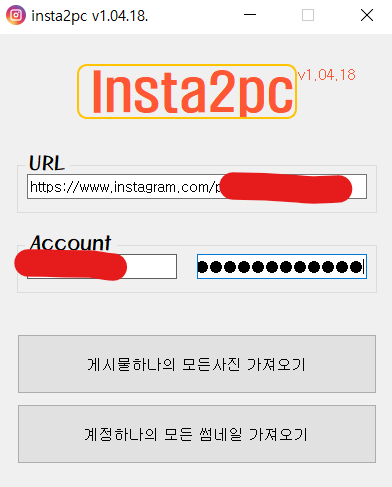

# Insta2pc

**K-Instagram pics downloader**

인스타그램 사진 다운용 v1.12.15.

---

## **기능**

- 하나의 게시글에 대한 모든 사진 다운로드
- 하나의 계정에 대한 모든 썸네일 다운로드
- ~~하나의 계정에 대한 모든 사진 다운로드(기능 수정 중)~~

## **사용법**

1. 실행합니다.

2. 원하는 모드에 따라서 URL 을 입력해주고 인스타그램과 연동되어있는 페이스북 계정을 입력해줍니다.
    
   ※ 될 수 있으면 현재 PC 에 로그인 되어있는 인스타그램을 로그아웃 하고 시도해줍시다.

3. 원하는 모드의 버튼을 누르고 기다려줍니다. 모든 과정은 자동으로 이루어지고, 오류가 있을 시 알림창으로 알려주기 때문에 기다리기만 하면됩니다.
    
   ※ 이 때, 크롬 브라우저가 열려도 절대 종료하지마세요!!! 사진 저장 후 자동으로 종료됩니다.

4. 현재 21.12.15. 기준 지원되는 모드는 총 두 가지 입니다.

- 하나의 게시물에 존재하는 사진 여러장 가져오기

- 하나의 계정에 존재하는 모든 썸네일 가져오기

## **유의사항**

- 크롬 브라우저가 깔려있는 상태여야 합니다.

- 빠른 시도의 로그인을 피하기 위해 로그인 과정은 8~10 초 정도 소요되니 이 점 참고 바랍니다.

## **FIX&UPDATE**

- **GUI 구현** [21.06.01 ~ 21.06.20]
- **Multi Threading 구현(with. QThread)** [21.06.17 ~ 21.06.20]
- **크롬 드라이버 자동 다운기능 추가** [21.06.20.]
- **버그 및 기능 고장 fix & Realese** [21.12.15.]

---

## **오류&문의사항**

a42873410@gmail.com
